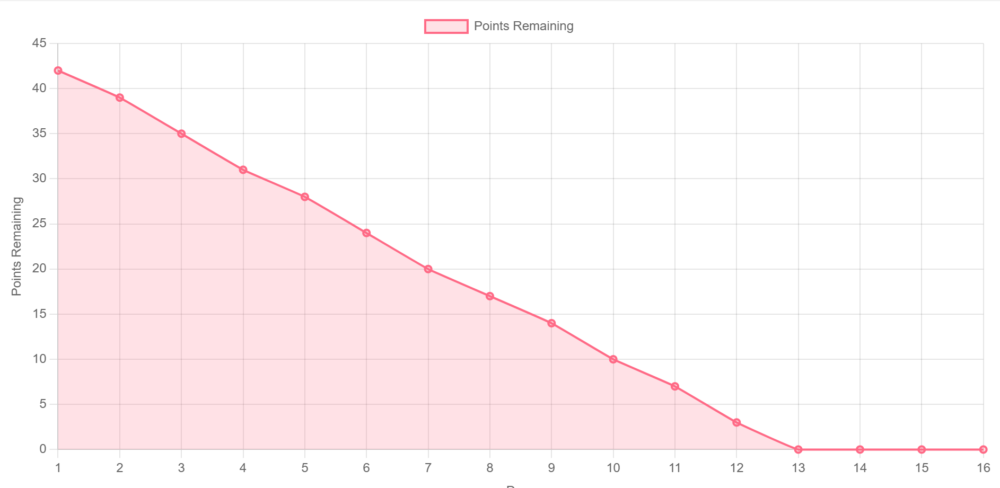
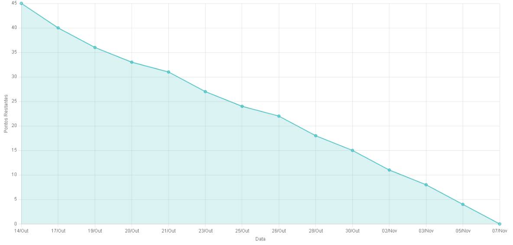

# 🎓 Fatec Centro Paula Souza, Jacareí - 3º DSM 2024

<p align="center">
 
 <h2 align="center">DATA SOLUTIONS GROUP</h2>
</p>

> Status: Development
> 


## 💻  Sobre o Projeto:

Este é um aplicativo web desenvolvido em **React** que ajuda os usuários a monitorar sua ingestão diária de nutrientes, auxiliando na manutenção de uma dieta equilibrada e saudável. Ideal para quem deseja acompanhar o consumo de alimentos e garantir a ingestão correta de nutrientes essenciais.

## 📋 Funcionalidades:

- **Interface Amigável:** Fácil navegação para acompanhar a ingestão de nutrientes.
- **Metas Nutricionais Personalizadas:** Definição de metas específicas para diferentes nutrientes (por exemplo, proteínas, carboidratos, vitaminas).
- **Banco de Dados de Alimentos:** Pesquisa e registro de alimentos com informações nutricionais detalhadas.
- **Visualização do Progresso:** Gráficos e resumos para acompanhar o desempenho ao longo do tempo.
- **Sugestões de Receitas:** Receitas personalizadas com base nas necessidades nutricionais do usuário.

## 📑 Pré-requisitos:

- **Node.js** (v14 ou superior)
- **React** (v17 ou superior)
- **TypeScript** (para segurança de tipos)
- **MongoDB** (v4.4 ou superior)
  
## Front-End - React ⚛️

A interface web foi desenvolvida utilizando **React** com **TypeScript**, oferecendo uma experiência de usuário moderna e responsiva.

- **React Router** para a navegação entre páginas.
- **Axios** para fazer requisições à API do servidor.
- **Styled Components** para estilização e design da interface.

## Back-End (Node.js e Express)

O back-end é construído utilizando **Node.js** com **Express** e interage com o banco de dados **MongoDB** para armazenar e gerenciar dados nutricionais.

- **Mongo Atlas** banco de dados nuvem, para garantir segurança no projeto.
- **Mongoose** para manipular dados no MongoDB.
- **Autenticação** com JWT para garantir a segurança das sessões de usuários.

## Estrutura de Pastas

```bash
├── client              # Aplicação web React
│   ├── src
│   └── public
├── server              # Back-end Express
│   ├── controllers     # Controladores da API
│   ├── models          # Modelos do MongoDB
│   ├── routes          # Rotas da API
│   └── middleware      # Middleware de autenticação
└── .env                # Variáveis de ambiente
```

## 📊 Tecnologias Utilizadas

- **React** (front-end)
- **TypeScript** (front-end)
- **MongoDB** (banco de dados)
- **Express.js** (back-end)
- **Node.js** (runtime)

## 💡 Melhorias Futuras

- **Relatórios Nutricionais Avançados:** Análises detalhadas para melhor acompanhamento da dieta.
- **Sugestões com IA:** Recomendação de alimentos baseada em hábitos alimentares.
- **Integração com Apps de Saúde:** Sincronização com aplicativos de fitness para monitoramento mais completo.

## 🤝 Contribuindo

Contribuições são bem-vindas! Veja o nosso [Guia de Contribuição](CONTRIBUTING.md) para mais detalhes sobre como começar.

---

## 📄 Licença

Este projeto está licenciado sob a Licença MIT - veja o arquivo [LICENSE](LICENSE) para mais detalhes.

---

## 🧑‍💻 Autores

| Função            | Nome              | LinkedIn                                                     | GitHub                                                      |
|-------------------|-------------------|--------------------------------------------------------------|-------------------------------------------------------------|
| SCRUM MASTER      | Fillipe Pereira Bueno de Almeida  | [](https://www.linkedin.com/in/fillipe-almeida-46017025b) | [](https://github.com/FPbueno) |
| PRODUCT OWNER     | Isaac Souza Santos  | [](https://www.linkedin.com/in/isaac-santos-402029158) | [](https://github.com/Isaac-Exon) |
| DEV TEAM          | Tiago Santini Da Silva  | [](https://www.linkedin.com/in/tiago-santini-da-silva-b545752a6) | [](https://github.com/TiagoSan23) |
| DEV TEAM          | Renan Ming Han  | [](https://www.linkedin.com/in/renan-ming-) | [](https://github.com/MingRenan) |


# React + TypeScript + Vite

This template provides a minimal setup to get React working in Vite with HMR and some ESLint rules.

Currently, two official plugins are available:

- [@vitejs/plugin-react](https://github.com/vitejs/vite-plugin-react/blob/main/packages/plugin-react/README.md) uses [Babel](https://babeljs.io/) for Fast Refresh
- [@vitejs/plugin-react-swc](https://github.com/vitejs/vite-plugin-react-swc) uses [SWC](https://swc.rs/) for Fast Refresh

## Expanding the ESLint configuration

If you are developing a production application, we recommend updating the configuration to enable type aware lint rules:

- Configure the top-level `parserOptions` property like this:

```js
export default {
  // other rules...
  parserOptions: {
    ecmaVersion: 'latest',
    sourceType: 'module',
    project: ['./tsconfig.json', './tsconfig.node.json'],
    tsconfigRootDir: __dirname,
  },
}
```

- Replace `plugin:@typescript-eslint/recommended` to `plugin:@typescript-eslint/recommended-type-checked` or `plugin:@typescript-eslint/strict-type-checked`
- Optionally add `plugin:@typescript-eslint/stylistic-type-checked`
- Install [eslint-plugin-react](https://github.com/jsx-eslint/eslint-plugin-react) and add `plugin:react/recommended` & `plugin:react/jsx-runtime` to the `extends` list

# **Aplicação de Controle de Calorias e Nutrientes**

---

## Product Backlog

| ID  | História do Usuário | Prioridade | Critérios de Aceitação |
|-----|----------------------|------------|-------------------------|
| 1   | Como usuário, quero registrar a quantidade de calorias consumidas diariamente para monitorar minha ingestão calórica. | Alta | - Inserção de calorias por refeição.<br>- Somatório e exibição do total diário.<br>- Dados editáveis/excluíveis. |
| 2   | Como usuário, quero registrar a quantidade de proteínas, carboidratos e gorduras para monitorar minha ingestão de nutrientes. | Alta | - Inserção de nutrientes por refeição.<br>- Somatório e exibição do total diário.<br>- Dados editáveis/excluíveis. |
| 3   | Como usuário, quero visualizar um resumo diário das calorias e nutrientes consumidos para acompanhar minha alimentação. | Alta | - Resumo diário exibe total de calorias e nutrientes.<br>- Atualização automática após inserção. |
| 4   | Como usuário, quero registrar refeições com itens específicos e suas quantidades para controlar os alimentos consumidos. | Média | - Adição de itens alimentares específicos com calorias e nutrientes.<br>- Itens editáveis/excluíveis. |
| 5   | Como usuário, quero acompanhar o consumo de vitaminas e minerais essenciais para monitorar minha saúde. | Média | - Registro e resumo diário de vitaminas e minerais consumidos. |
| 6   | Como usuário, quero definir uma meta diária de calorias e nutrientes para gerenciar minha dieta. | Alta | - Definição e comparação de metas com o consumo atual.<br>- Exibição de progresso. |
| 7   | Como usuário com restrições alimentares, quero personalizar minha dieta com itens permitidos para evitar complicações de saúde. | Alta | - Configuração de restrições alimentares (ex.: glúten, lactose).<br>- Alerta ao adicionar alimentos fora das restrições. |
| 8   | Como usuário com diabetes, quero controlar a ingestão de carboidratos para gerenciar os níveis de glicose no sangue. | Alta | - Definição de limite de carboidratos.<br>- Alerta ao atingir ou ultrapassar o limite. |
| 9   | Como usuário, quero gerar relatórios semanais/mensais do consumo de calorias e nutrientes para análise de longo prazo. | Média | - Relatórios de consumo diário, semanal e mensal.<br>- Exportação em PDF/CSV. |
| 10  | Como usuário, quero receber orientações personalizadas com base nos dados de ingestão para melhorar minha alimentação. | Baixa | - Recomendações básicas com base nos dados registrados (ex.: reduzir calorias, aumentar proteínas). |
| 11  | Como usuário, quero registrar dados de acompanhamento médico, como peso e IMC, para avaliar o impacto da dieta na saúde. | Média | - Registro periódico de peso e IMC.<br>- Exibição de gráficos de evolução. |
| 12  | Como usuário, quero definir lembretes de refeições e de registro de ingestão para manter minha rotina alimentar. | Baixa | - Configuração de lembretes de refeições.<br>- Notificações enviadas por e-mail ou navegador. |


# 🏃‍♂️ Sprint Backlog - Sprint 2

## Data da Sprint
- **Início:** 23/Set
- **Término:** 08/Out
## Objetivos da Sprint
- Implementar novas funcionalidades para melhorar a experiência do usuário e a funcionalidade do aplicativo.
  
- **Melhorar a Experiência do Usuário e a Funcionalidade do Aplicativo:** Esta sprint teve como foco aprimorar a navegação e usabilidade do aplicativo, garantindo uma experiência mais intuitiva e eficiente para os usuários. Adicionamos funcionalidades de navegação aos botões da tela inicial, facilitando a transição entre diferentes seções do aplicativo.

- **Fortalecer a Infraestrutura de Dados e Segurança:** Colocamos o banco de dados em nuvem para melhorar a escalabilidade e segurança dos dados, além de implementar um sistema de login robusto com criação de usuário, autenticação de rotas e armazenamento seguro no local storage.

- **Expansão das Funcionalidades do App:** Criamos uma série de novas funcionalidades para enriquecer a experiência do usuário, como a implementação da interface de login no front-end, adição de gráficos relacionados aos alimentos e a introdução de um sistema de calendários. Também trabalhamos na funcionalidade de nutrientes e no cálculo de IMC, permitindo que os usuários insiram e visualizem esses dados de forma interativa.

- **Autenticação e Recuperação de Senha:** Adicionamos a possibilidade de login com autenticação via Google e uma opção para recuperação de senha por e-mail, tornando o processo de login mais flexível e seguro para os usuários.

- **Integração de Funcionalidades do Backend:** Realizamos a criação de métodos para login no backend e desenvolvemos funções para a inserção de informações específicas, como os dados relacionados ao consumo de água, garantindo que todos os dados do usuário sejam processados de maneira eficaz e segura.

Essas melhorias visam proporcionar uma aplicação mais completa, funcional e segura, com foco na experiência e na satisfação do usuário, mantendo uma arquitetura sólida e escalável.


## Tarefas

| ID  | Tarefa                                                                                   | Responsável | Status          | Estimativa (Pontos) | Conclusão (Data)  |
|-----|------------------------------------------------------------------------------------------|-------------|------------------|---------------------|--------------------|
| SB-01 | Adicionar funcionalidades de navegação aos botões da tela inicial                      | [Isaac Souza]      | ✅ Concluído      | 3                   | 25/Set              |
| SB-02 | Colocar o banco de dados em nuvem                                                       | [Nome]      | ✅ Concluído      | 3                   | 26/Set              |
| SB-03 | Construir login com criação de usuário                                                  | [Isaac Souza]      | ✅ Concluído      | 4                   | 28/Set              |
| SB-04 | Criar autenticação de rotas e salvá-las no local storage                                | [Isaac Souza]      | ✅ Concluído      | 4                   | 30/Set              |
| SB-05 | Criar função para inserção de informações do componente água                            | [Nome]      | ✅ Concluído      | 2                   | 01/Out              |
| SB-06 | Implementação da feature de nutrientes no Front                                          | [Nome]      | ✅ Concluído      | 3                   | 02/Out              |
| SB-07 | Criar interface de login no Front end                                                   | [Isaac Souza]      | ✅ Concluído      | 3                   | 03/Out              |
| SB-08 | Fazer método de login no back end                                                        | [Isaac Souza]      | ✅ Concluído      | 4                   | 04/Out              |
| SB-09 | Implementação de gráficos relacionados aos alimentos na tela de alimentos                | [Nome]      | ✅ Concluído      | 3                   | 05/Out              |
| SB-10 | Implementar interface onde permita o usuário inserir dados para o cálculo de IMC       | [Isaac Souza]      | ✅ Concluído      | 3                   | 06/Out              |
| SB-11 | Implementar sistema de calendários na tela inicial                                       | [Nome]      | ✅ Concluído      | 3                   | 07/Out              |
| SB-12 | Login deve permitir autenticação com o Google                                           | [Isaac Souza]      | ✅ Concluído      | 4                   | 08/Out              |
| SB-13 | Login deve permitir recuperação de senha através do email                                | [Nome]      | ✅ Concluído      | 3                   | 08/Out              |
| SB-14 | Mostrar o resultado do cálculo de IMC na tela inicial                                   | [Nome]      | ✅ Concluído      | 2                   | 08/Out              |

## Total de Pontos de Esforço: 42

## 📉 Burndown Chart

| Dia        | Pontos Restantes |



# 🏃‍♂️ Sprint Backlog - Sprint 3

## Data da Sprint
- **Início:** 14/Out
- **Término:** 08/Nov

## Objetivos da Sprint
- **Implementação de funcionalidades de captura e armazenamento de fotos.**
- **Tratamento de respostas de interface seguindo as diretrizes de Nielsen para melhorar a experiência do usuário.**
- **Ajustes de layout para uma interface minimalista e eficiente.**
- **Desenvolvimento e exibição de gráficos de IMC e consumo de água para melhor visualização dos dados do usuário.**
- **Desenvolvimento de funcionalidades para gerenciamento de consumo de água.**

## Tarefas

| ID   | Tarefa                                                                                              | Responsável       | Status          | Estimativa (Pontos) | Conclusão (Data)  |
|------|-----------------------------------------------------------------------------------------------------|-------------------|------------------|---------------------|--------------------|
| SB-01 | Implementar biblioteca de câmera para captura e armazenamento de fotos no banco de dados.           | [Nome]            | ✅ Concluído     | 5                   | 17/Out             |
| SB-02 | Aplicar tratamento de respostas de interface conforme a Lei de Nielsen.                             | [Nome]            | ✅ Concluído     | 4                   | 19/Out             |
| SB-03 | Ajustar layout da tela inicial com design minimalista segundo Nielsen.                              | [Nome]            | ✅ Concluído     | 3                   | 20/Out             |
| SB-04 | Exibir dados de IMC na interface.                                                                   | [Nome]            | ✅ Concluído     | 2                   | 21/Out             |
| SB-05 | Construir gráfico de IMC para acompanhamento visual dos dados.                                      | [Nome]            | ✅ Concluído     | 4                   | 23/Out             |
| SB-06 | Verificar e ajustar a base de dados de `profile` para integração de novas funcionalidades.          | [Nome]            | ✅ Concluído     | 3                   | 25/Out             |
| SB-07 | Realizar ajustes nas funcionalidades do modal da página de alimentos.                               | [Nome]            | ✅ Concluído     | 2                   | 26/Out             |
| SB-08 | Construir gráficos para exibição das calorias necessárias para consumo.                             | [Nome]            | ✅ Concluído     | 4                   | 28/Out             |
| SB-09 | Criar gráfico na tela inicial para exibição do consumo ideal de água.                               | [Nome]            | ✅ Concluído     | 3                   | 30/Out             |
| SB-10 | Desenvolver contexto para funcionalidades relacionadas à água (ex.: cálculo de consumo).            | [Nome]            | ✅ Concluído     | 4                   | 02/Nov             |
| SB-11 | Implementar funcionalidades dos botões "água mais" e "água menos" para ajuste do consumo.           | [Nome]            | ✅ Concluído     | 3                   | 03/Nov             |
| SB-12 | Atualizar a coleção `Agua` no banco de dados para salvar dados de consumo diário por usuário.       | [Nome]            | ✅ Concluído     | 4                   | 05/Nov             |
| SB-13 | Criar rota GET para buscar a quantidade de água consumida no dia selecionado no modal calendário.   | [Nome]            | ✅ Concluído     | 4                   | 07/Nov             |

## Total de Pontos de Esforço: 45

---

## 📉 Burndown Chart



---

**Nota:** Todas as tarefas foram concluídas de acordo com as datas definidas para cada entrega.
